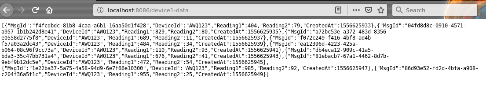

# IOT NATS Example
This program is a simple example of using NATS for IOT applications.

In this application there are two asynchronous processes, 
* The first one is a simulation of a device which is generating data every 2 seconds. 
* The other one is the listener to the message notification and appending the datalist. 

The http server running on the port 8086 with the end-point /device1-data returns datalist in the JSON format. 

